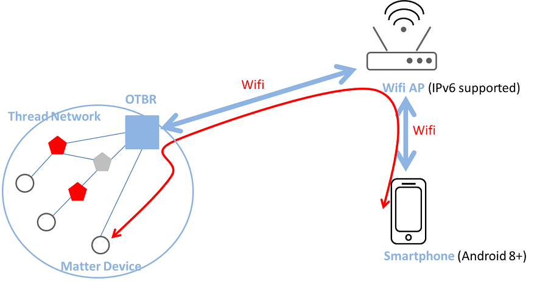

.. _OpenThread_Border_Router_cn:

=====================
OpenThread 边界路由器
=====================

边界路由器是能够在网状网络内外路由数据包的设备。Thread 边界路由器是连接 Thread 网络和其他基于 IP 的网络 (如 Wi-Fi 或以太网) 的设备。以下是 OTBR 支持的关键网络功能：

* Thread 和 Wi-Fi/以太网网络之间的双向 IP 连接。
* 通过 mDNS (在 Wi-Fi/以太网链路上) 和 SRP (在 Thread 网络中) 进行双向服务发现。
* 基于基础架构的 Thread 分区通过 IP 链路合并。
* 外部 Thread 委托 (例如，手机) 来验证并将 Thread 设备加入 Thread 网络。

 
	通过 OTBR 连接 Thread 网络和其他基于 IP 的网络

需求
====

要建立 OpenThread 边界路由器 (OTBR) 环境，请确保您拥有以下硬件和软件。以下是详细的设置要求：

硬件
----
* 一台树莓派 3/4 设备和至少 8 GB 容量的 SD 卡

* 一台未在路由器上启用 IPv6 Router Advertisement Guard 的 Wi-Fi AP

* 8771GUV RCP dongle

* Matter 设备 (例如智能插座)

* 一台至少搭载 Android 8.1 的 Android 手机

软件
----
* `树莓派 Imager <https://www.raspberrypi.com/software/>`_

* `Android App (CHIPTool) <https://github.com/project-chip/connectedhomeip/blob/master/docs/guides/android_building.md>`_

.. list-table:: 需求
   :header-rows: 1
   :stub-columns: 1
   :align: center
   :name: 表格-需求

   * - 角色
     - 硬件
     - 软件
   * - OTBR
     - 树莓派
       
       RTL8771GUV RCP dongle
     - 树莓派 Imager
   * - Wi-Fi AP
     - Wi-Fi AP
     -
   * - Thread 终端设备
     - Matter 设备 (例如智能插座)
     -
   * - 测试设备
     - Android 手机
     - CHIPTool

环境设置和测试流程
==================

在树莓派上设置 OTBR
-------------------

.. admonition:: 前提条件
  用户应为 OTBR 准备一个 RCP 模式的 Thread 设备。

 * 设置树莓派。

 * 下载并安装 `树莓派 Imager <https://www.raspberrypi.com/software/>`_。

 * 选择 :menuselection:`选择操作系统 --> 其他通用操作系统 --> Ubuntu --> Ubuntu 20.04 或更高版本 (32 位或 64 位)`。

   .. figure:: ../figures/raspi_setup1.png
	  :width: 80%
	  :align: center
   

 * 选择 :menuselection:`选择存储 --> 选择外部 SD 卡`。

   .. figure:: ../figures/raspi_setup2.png
	  :width: 40%
	  :align: center

 * 选择 :guilabel:`设置`， 填入 :kbd:`主机名` 字段，勾选 :guilabel:`启用 SSH`，并填入用户名和密码字段，必要时勾选 :guilabel:`配置无线局域网`，并填入 SSID 和密码字段。

   .. figure:: ../figures/raspi_setup3.png
	  :width: 80%
	  :align: center
 
 * 保存并点击写入按钮，将引导镜像写入 SD 卡。

 * 将 SD 卡插入树莓派并上电，现在您已完成树莓派的设置。

.. highlight:: rst

1. 克隆 OTBR 仓库。
   
   .. parsed-literal::
     :class: command

     $ git clone https://github.com/openthread/ot-br-posix

	
2. 修改 RCP dongle 的设备端口。

   * 将设备端口修改为 :kbd:`ttyACM0`，波特率修改为 :kbd:`2000000`。

   .. parsed-literal::
     :class: command

     $ cd ot-br-posix
     $ vi CMakeLists.txt
     set(OTBR_RADIO_URL "spinel+hdlc+uart:///dev/ttyACM0?uart-baudrate=2000000"

3. 构建并安装 OTBR。

   * 安装依赖。

   .. parsed-literal::
     :class: command

     $ ./script/bootstrap

   * 使用以太网进行边界路由。

   .. parsed-literal::
     :class: command

     $ INFRA_IF_NAME=eth0 ./script/setup

   * 使用 WiFi 进行边界路由。

   .. parsed-literal::
     :class: command

     $ INFRA_IF_NAME=wlan0 ./script/setup

  .. note::
    如果不确定网络接口名称，可以输入 :kbd:`ifconfig` 命令列出所有网络接口。

4. 验证 8771GUV RCP dongle 用于 OTBR。

   * 将 USB 端口连接到树莓派和 8771GUV RCP dongle 之间。
   * 重启并检查 OTBR 状态。
   * 8771GUV 会被识别为 :kbd:`/dev/ttyACM0`，活跃 (运行) 状态表示您成功在树莓派上设置了 OTBR。

   
   .. parsed-literal::
     :class: command

     $ sudo service otbr-agent restart
     $ sudo service otbr-agent status
     ● otbr-agent.service - Border Router Agent
     Loaded: loaded (/lib/systemd/system/otbr-agent.service; enabled; vendor preset: enabled)
     Active: active (running) since Mon 2021-03-01 05:46:26 GMT; 2s ago
     Main PID: 2997 (otbr-agent)
       Tasks: 1 (limit: 4915)
     CGroup: /system.slice/otbr-agent.service
              └─2997 /usr/sbin/otbr-agent -I wpan0 -B wlan0 spinel+hdlc+uart:///dev/ttyACM0?uart-baudrate…
     Mar 01 05:46:26 raspberrypi otbr-agent[2997]: Initialize OpenThread Border Router Agent: OK
     Mar 01 05:46:26 raspberrypi otbr-agent[2997]: Border router agent started.

	
测试步骤
----------

按照以下指示操作：

1. 启动 OTBR 并形成 Thread 网络。

   * 启动 :kbd:`otbr-agent` 服务。

   .. parsed-literal::
     :class: command

     $ sudo service otbr-agent restart
     $ sudo service otbr-agent status
     ● otbr-agent.service - Border Router Agent
     Loaded: loaded (/lib/systemd/system/otbr-agent.service; enabled; vendor preset: enabled)
     Active: active (running) since Mon 2021-03-01 05:46:26 GMT; 2s ago
     Main PID: 2997 (otbr-agent)
       Tasks: 1 (limit: 4915)
     CGroup: /system.slice/otbr-agent.service
              └─2997 /usr/sbin/otbr-agent -I wpan0 -B wlan0 spinel+hdlc+uart:///dev/ttyACM0?uart-baudrate…
     Mar 01 05:46:26 raspberrypi otbr-agent[2997]: Initialize OpenThread Border Router Agent: OK
     Mar 01 05:46:26 raspberrypi otbr-agent[2997]: Border router agent started.

   * 形成 Thread 网络。

   .. parsed-literal::
     :class: command

     $ ot-ctl dataset init new
     $ ot-ctl dataset commit active
     $ ot-ctl ifconfig up
     $ ot-ctl thread start

   * 等待几秒钟并验证网络状态。

   .. tip::
     确保 OTBR 成为 leader 角色。

   .. parsed-literal::
     :class: command

     $ ot-ctl state
     leader

   .. parsed-literal::
     :class: command  

     $ ot-ctl netdata show
     Prefixes:
     fd76:a5d1:fcb0:1707::/64 paos med 4000
     Routes:
     fd49:7770:7fc5:0::/64 s med 4000
     Services:
     44970 5d c000 s 4000
     44970 01 9a04b000000e10 s 4000
     Done

   .. parsed-literal::
     :class: command   

     $ ot-ctl ipaddr
     fda8:5ce9:df1e:6620:0:ff:fe00:fc11
     fda8:5ce9:df1e:6620:0:0:0:fc38
     fda8:5ce9:df1e:6620:0:ff:fe00:fc10
     fd76:a5d1:fcb0:1707:f3c7:d88c:efd1:24a9
     fda8:5ce9:df1e:6620:0:ff:fe00:fc00
     fda8:5ce9:df1e:6620:0:ff:fe00:4000
     fda8:5ce9:df1e:6620:3593:acfc:10db:1a8d
     fe80:0:0:0:a6:301c:3e9f:2f5b
     Done

2. 打开 Matter 设备。

   * 打开 Matter 设备电源。
   
   * 等待手机开始配网过程。

  .. note::
    请注意，如果 Matter 设备已与其他移动设备配网，您可以按照 Matter 设备的指南将其恢复出厂设置 (例如：按住电源键 10 秒)。

3. 将手机连接到 WiFi。

   * 将手机连接到与 OTBR 相同的 WiFi 接入点 (AP) 。
   
   * 确保手机和 OTBR 在同一网络上。

4. 启动 CHIPTool App。

   * 选择 :kbd:`PROVISION CHIP DEVICE WITH THREAD` 项目扫描 Matter 设备的二维码。
   
   * 一旦成功，将显示 OTBR 的设置页面，如下图所示。

   .. figure:: ../figures/chiptool1.png
     :width: 70%
     :align: center

   * 填写 OTBR 的相应设置后，点击 :kbd:`SAVE NETWORK` 开始配网。

   * 用户可以在 OTBR 上输入以下命令以获取相应设置：

   .. parsed-literal::
     :class: command

     $ ot-ctl channel
     $ ot-ctl panid
     $ ot-ctl extpanid
     $ ot-ctl networkkey  

   .. note:: 在开发阶段，由于尚未获得正式证书，配网过程中可能会弹出如下图所示的对话框。请选择 :kbd:`CONTINUE` 继续。右下角显示的对话框弹出时，表示配网成功。

   .. figure:: ../figures/chiptool2.png
     :width: 70%
     :align: center
   
   
5. 完成调试。

   * 等待调试过程完成。
   
   * 完成后，继续下一步。

6. 进入控制面板。

   * 在 **CHIPTool** 应用中，选择菜单项：:kbd:`LIGHT ON/OFF & LEVEL CLUSTER`。
   
   * 这将打开 Matter 设备的控制面板。

7. 控制 Matter 设备。
   
   * 使用手机通过 OTBR 控制 Matter 设备。
   
   * 测试打开和关闭灯光、调节灯光亮度等功能。
   
   * 最后，你可以通过手机通过 OTBR 按下图控制 Matter 设备。

   .. figure:: ../figures/chiptool3.png
     :width: 70%
     :align: center

   * 下图说明了通过 OTBR 控制 Matter 设备的测试步骤。

   .. figure:: ../figures/otbr_test_steps.png
     :width: 80%
     :align: center
	
     通过 OTBR 控制 Matter 设备的测试步骤

.. highlight:: none