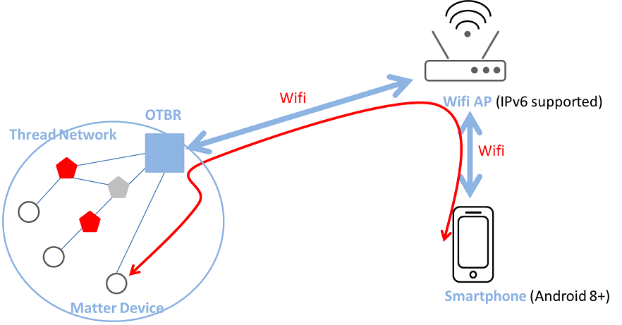

.. _OpenThread_Border_Router:

========================
OpenThread Border Router
========================

A Border Router is a device that could route packets to and from the mesh network. A Thread Border Router is the
device connected a Thread network and other IP-based networks, such as Wi-Fi or Ethernet. The key networking
features supported by OTBR are listed below:

* Bidirectional IP connectivity between Thread and Wi-Fi/Ethernet networks.
* Bidirectional service discovery via mDNS (on Wi-Fi/Ethernet link) and SRP (on Thread network).
* Thread-over-infrastructure that merges Thread partitions over IP-based links.
* External Thread Commissioning (e.g. a mobile phone) to authenticate and join a Thread device to a Thread network.

	Thread network and other IP-based networks connected through OTBR
  
Requirements
============

To set up an OpenThread Border Router (OTBR) environment, ensure you have the following hardware and software. Below are the detailed requirements for the setup:

Hardware
--------
* A Raspberry Pi 3/4 device and a SD card with at least 8 GB capability

* A Wi-Fi AP without IPv6 Router Advertisement Guard enabled on the router

* 8771GUV RCP dongle

* Matter device (e.g. smart plug)

* Android phone with at least Android 8.1

Software
--------
* `Raspberry Pi Imager <https://www.raspberrypi.com/software/>`_

* `Android App (CHIPTool) <https://github.com/project-chip/connectedhomeip/blob/master/docs/guides/android_building.md>`_

.. list-table:: Requirements
   :header-rows: 1
   :stub-columns: 1
   :align: center
   :name: Table-Requirements

   * - Role
     - Hardware
     - Software
   * - OTBR
     - Raspberry Pi
       
       RTL8771GUV RCP dongle
     - Raspberry Pi Imager
   * - Wi-Fi AP
     - Wi-Fi AP
     -
   * - Thread end device
     - Matter device (e.g. smart plug)
     -
   * - Test device
     - Android phone
     - CHIPTool

Environment Setup and Test Flows
================================

Setup OTBR on Raspberry Pi
--------------------------

.. admonition:: Prerequisite: User sould prepare a RCP mode Thread device for OTBR.

 * Setup Respberry Pi.

 * Download and install `Raspberry Pi Imager <https://www.raspberrypi.com/software/>`_.

 * Select :menuselection:`Choose OS --> Other general-purpose OS --> Ubuntu --> Ubuntu 20.04 upper version (32-bit) or (64 bit)`.
      
   .. figure:: ../figures/raspi_setup1.png
	  :width: 80%
	  :align: center
   
	   
 * Select :menuselection:`Choose Storage --> select the external SD card`.
   
   .. figure:: ../figures/raspi_setup2.png
	  :width: 40%
	  :align: center
   
 * Select :guilabel:`Settings`, Fill in the :kbd:`hostname field`, check :guilabel:`enable SSH` and fill in the username and password fields, check :guilabel:`Configure wireless LAN` and fill in the SSID and password fileds if necessary.
   
   .. figure:: ../figures/raspi_setup3.png
	  :width: 80%
	  :align: center
   
 * Save and click write button to flash the boot image into the SD card.

 * Insert the SD card into Raspberry Pi and power on, now you finished the setup of Raspberry Pi.

.. highlight:: rst

1. Clone the OTBR repository.
   
   .. parsed-literal::
     :class: command

     $ git clone https://github.com/openthread/ot-br-posix

	
2. Modify the device port of RCP dongle.

   * Modify the device port as :kbd:`ttyACM0` and the baudrate as :kbd:`2000000`.
	
   .. parsed-literal::
     :class: command

     $ cd ot-br-posix
     $ vi CMakeLists.txt
     set(OTBR_RADIO_URL "spinel+hdlc+uart:///dev/ttyACM0?uart-baudrate=2000000"
	   

3. Build and install OTBR.

   * Install dependencies.
		
   .. parsed-literal::
     :class: command

     $ ./script/bootstrap
		
   * Use Ethernet for border routing.
		
   .. parsed-literal::
     :class: command

     $ INFRA_IF_NAME=eth0 ./script/setup
			
   * Use Wifi for border routing.

   .. parsed-literal::
     :class: command

     $ INFRA_IF_NAME=wlan0 ./script/setup
	 
  .. note::
    Note that if you are not sure what the network interface name is. You could type :kbd:`ifconfig` command to list all the network interfaces.
	
4. Verify the 8771GUV RCP dongle for OTBR.

   1. Connect the usb port between Raspberry Pi and 8771GUV RCP dongle.
   
   2. Restart and check OTBR status.
   
   3. 8771GUV would be recognized as :kbd:`/dev/ttyACM0` and the active (running) state indicates you succeed the setup of OTBR on Raspberry Pi.

   .. parsed-literal::
     :class: command
			
     $ sudo service otbr-agent restart
     $ sudo service otbr-agent status
     ● otbr-agent.service - Border Router Agent
     Loaded: loaded (/lib/systemd/system/otbr-agent.service; enabled; vendor preset: enabled)
     Active: active (running) since Mon 2021-03-01 05:46:26 GMT; 2s ago
     Main PID: 2997 (otbr-agent)
       Tasks: 1 (limit: 4915)
     CGroup: /system.slice/otbr-agent.service
              └─2997 /usr/sbin/otbr-agent -I wpan0 -B wlan0 spinel+hdlc+uart:///dev/ttyACM0?uart-baudrate..
     Mar 01 05:46:26 raspberrypi otbr-agent[2997]: Initialize OpenThread Border Router Agent: OK
     Mar 01 05:46:26 raspberrypi otbr-agent[2997]: Border router agent started.

Test Steps
----------

Follow the instructions provided below:

1. Start OTBR and Form Thread Network.
   
   
   * Start the :kbd:`otbr-agent` service.

   .. parsed-literal::
     :class: command

     $ sudo service otbr-agent restart
     $ sudo service otbr-agent status
     ● otbr-agent.service - Border Router Agent
     Loaded: loaded (/lib/systemd/system/otbr-agent.service; enabled; vendor preset: enabled)
     Active: active (running) since Mon 2021-03-01 05:46:26 GMT; 2s ago
     Main PID: 2997 (otbr-agent)
       Tasks: 1 (limit: 4915)
     CGroup: /system.slice/otbr-agent.service
              └─2997 /usr/sbin/otbr-agent -I wpan0 -B wlan0 spinel+hdlc+uart:///dev/ttyACM0?uart-baudrate…
     Mar 01 05:46:26 raspberrypi otbr-agent[2997]: Initialize OpenThread Border Router Agent: OK
     Mar 01 05:46:26 raspberrypi otbr-agent[2997]: Border router agent started.
  
   * Form a Thread network.

   .. parsed-literal::
     :class: command

     $ ot-ctl dataset init new
     $ ot-ctl dataset commit active
     $ ot-ctl ifconfig up
     $ ot-ctl thread start
  
   * Wait a few seconds and verify the network status.

   .. tip::
     Make sure the OTBR become the leader role.
 
   .. parsed-literal::
     :class: command
  
     $ ot-ctl state
     leader
  
  
   .. parsed-literal::
     :class: command  
  
     $ ot-ctl netdata show
     Prefixes:
     Prefixes:
     fd76:a5d1:fcb0:1707::/64 paos med 4000
     Routes:
     fd49:7770:7fc5:0::/64 s med 4000
     Services:
     44970 5d c000 s 4000
     44970 01 9a04b000000e10 s 4000
     Done

   .. parsed-literal::
     :class: command   
  
     $ ot-ctl ipaddr
     fda8:5ce9:df1e:6620:0:ff:fe00:fc11
     fda8:5ce9:df1e:6620:0:0:0:fc38
     fda8:5ce9:df1e:6620:0:ff:fe00:fc10
     fd76:a5d1:fcb0:1707:f3c7:d88c:efd1:24a9
     fda8:5ce9:df1e:6620:0:ff:fe00:fc00
     fda8:5ce9:df1e:6620:0:ff:fe00:4000
     fda8:5ce9:df1e:6620:3593:acfc:10db:1a8d
     fe80:0:0:0:a6:301c:3e9f:2f5b
     Done
  
  
2. Power On Matter Device.

   * Power on the Matter device.
   
   * Wait for the commissioning process to start from Mobile phone.

  .. note::
    Note that if the Matter device has been commissioned with other mobile device, you could follow the	guideline of Matter device to factory reset it (e.g. press and hold the power on button for 10s).

3. Connect Mobile Phone to WiFi.

   * Connect your mobile phone to the same WiFi Access Point (AP) as the OTBR.
   
   * Ensure the mobile phone and OTBR are on the same network.

   
4. Launch CHIPTool App.

   * Select :kbd:`PROVISION CHIP DEVICE WITH THREAD` item to scan the QR code of Matter device.
   
   * Once successed, the settings page of OTBR would be displayed as figure down below.

   .. figure:: ../figures/chiptool1.png
     :width: 70%
     :align: center

   * Fill in the corresponded settings of OTBR then click :kbd:`SAVE NETWORK` to start commissioning. 
	
   * You could type below commands on OTBR to get the corresponded settings:

   .. parsed-literal::
     :class: command
 
     $ ot-ctl channel
     $ ot-ctl panid
     $ ot-ctl extpanid
     $ ot-ctl networkkey  

   .. note:: Note that during the developing phase, since the official certificate has not yet been obtained, you may see the dialog box as shown below pop up during the commissioning process. Please select :kbd:`CONTINUE` to continue the process. When the dialog box shown on the bottom right pops up, it indicates successful commissioning. 

   .. figure:: ../figures/chiptool2.png
     :width: 70%
     :align: center
   
   
5. Complete Commissioning.
   
   * Wait for the commissioning process to complete.
   
   * Once completed, proceed to the next step.

6. Enter Control Panel.
   
   * In the **CHIPTool** app, select the menu item: :kbd:`LIGHT ON/OFF & LEVEL CLUSTER`.
   
   * This will open the control panel for the Matter device.

7. Control Matter Device.
   
   * Use your mobile phone to control the Matter device through the OTBR.
   
   * Test functionalities such as turning the light on and off, and adjusting the light levels.
   
   * Finally, you could control the Matter device as figure down below by the mobile phone through OTBR.

   .. figure:: ../figures/chiptool3.png
     :width: 70%
     :align: center

   * The figure below illustrates the test steps for controlling a Matter device via OTBR.

   .. figure:: ../figures/otbr_test_steps.png
     :width: 80%
     :align: center

     Test steps for controlling a Matter device via OTBR

.. highlight:: none