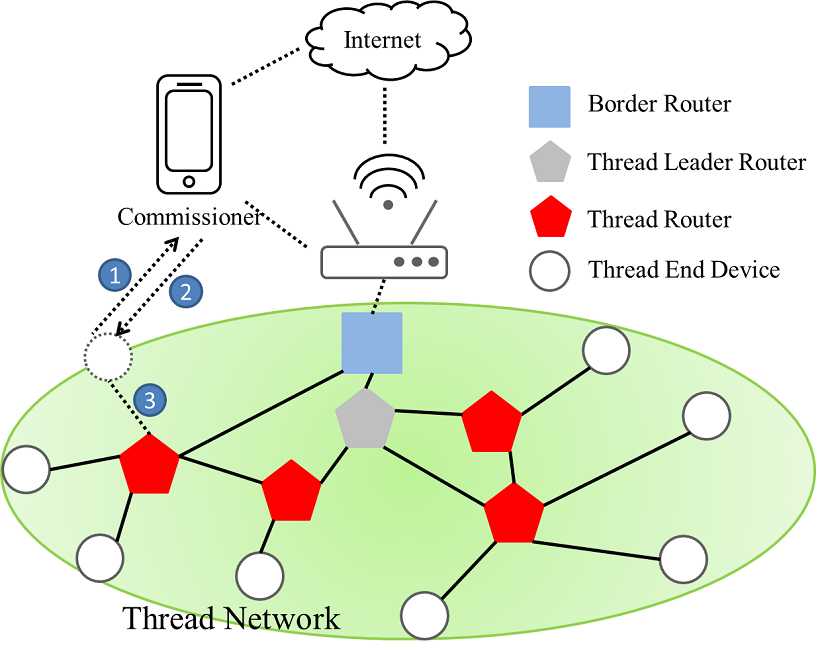
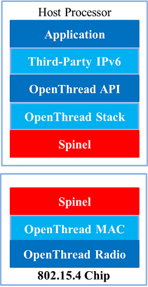

.. _thread_overview_cn:

===========
Thread 概述
===========

Thread 是一种基于 2.4GHz (IEEE 802.15.4) 和 IPv6 的无线自组织网络协议，通常称为无线个域网 (WPAN)。Thread 专为低功耗、低延迟的物联网 (IoT) 设备而设计。它解决了物联网的复杂问题，解决了互操作性、范围、安全性、能效和可靠性等挑战。

本节概述了 Thread 协议的网络拓扑结构、OpenThread 和无线电协处理器 (RCP) 模式。

网络拓扑
========

线程网络拓扑设计为强健、自愈和可扩展的，提供设备在网状网络中安全可靠的通信。以下是线程网络拓扑关键组件的概述。

设备类型
--------
OpenThread根据设备在线程网络中可以承担的角色，区分了各种设备类型。

1. **全线程设备 (FTD)**

   FTD可以在线程网络中同时作为路由器和终端设备运行。其无线电持续保持活跃。

2. **最小线程设备 (MTD)**

   MTD始终是终端设备，依赖其父设备转发所有消息。

   MTD有两个重要的子类型：

   - **最小终端设备 (MED)**
   
     此类型设备无线电始终保持开启，可以及时接收来自父设备的消息。MED适合需要更高响应速度、并且能够承受较高能耗的设备，例如有持续电源或可充电电池的设备。

   - **睡眠终端设备 (SED)**
   
     此类型设备通过大部分时间关闭无线电来节省能量，仅在定期唤醒与父设备通信时才开启。SED适合不需要频繁发送或接收数据的电池供电设备。

关键组件
--------

1. **领导路由器**

   领导设备负责管理网络，分配路由器ID并处理网络配置变更。领导是动态选举的，如果当前领导失效，其他路由器会接替以确保网络操作的连续。

2. **路由器**

   路由器在线程网络中路由数据包，帮助扩展网络范围并增强可靠性。路由器可以直接与其他路由器和领导通信。

   如果当前领导失效，路由器也可以成为领导。

3. **可成为路由器的终端设备 (REED)**

   这些终端设备在网络需要时有潜力成为路由器。只有在被领导提升为路由器时，它们才执行路由功能，从而保持资源的高效利用。

4. **终端设备**

   终端设备，也称为睡眠终端设备 (SED)，主要与单个父路由器或REED通信。它们不转发其他设备的数据包。SED节能效率高，因为大部分时间都处于低功耗状态。

5. **全终端设备 (FED)**

   全终端设备类似于终端设备，但它们保持唤醒以更频繁地接收数据包。它们不路由数据包，只与其父路由器通信。

6. **睡眠终端设备 (SED)**

   这些设备定期唤醒与父路由器交换数据，大部分时间都处于低功耗睡眠模式，适合电池供电的应用。

7. **专员 (Commissioner)**

   专员负责对网络中新设备进行认证和配置。它处理安全的加入过程，确保只有授权设备才能加入网络。专员可以是嵌入线程网络内部 (本地) 或在外部操作 (外部)。

8. **边界路由器**

   边界路由器将线程网络连接到其他网络，如Wi-Fi、以太网或互联网。它提供外部连接并在线程网络和外部网络之间路由数据。

外部线程配置
------------

在外部线程配置过程中，使用一个连接到不同网络 (如Wi-Fi或以太网) 的专员设备，而非线程网络。这个外部专员，例如手机，利用线程边界路由器作为中介，促进新设备加入线程网络。

以下是使用手机进行外部线程配置的过程:

1. 使用手机 APP 扫描 Thread 终端设备发出的 BLE 广播并进行 BLE 连接。

2. 手机 APP 通过 BLE 连接将 OTBR 网络的凭证同步到 Thread 终端设备。

3. Thread 终端设备使用凭证加入 Thread 网络。

示例网络拓扑
------------

下图展示了一个线程网络拓扑示例，并演示了使用手机进行外部配置的过程。

	线程网络拓扑示例
	
	

Openthread
==========

OpenThread 是一个开源实现的 Thread 网络协议。
它由 Google 开发，并免费提供给开发者，以加速连接家庭和商用建筑的产品开发。

GitHub
------

OpenThread 以 BSD 3-Clause 许可证发布，并在 GitHub 上可用：
https://github.com/openthread/openthread

设置和使用 OpenThread CLI 进行设备仿真
--------------------------------------

这个示例应用程序通过一个简单的命令行界面公开 OpenThread 的配置和管理 API。
以下步骤将带你完成从一个仿真 Thread 设备 ping 另一个仿真 Thread 设备所需的最少步骤。

从一个仿真 Thread 设备 ping 另一个的步骤
^^^^^^^^^^^^^^^^^^^^^^^^^^^^^^^^^^^^^^^^
.. highlight:: rst

1. 设置环境。

   - 安装编译 OpenThread 所需的依赖项和工具 (例如，GNU Autotools、GCC 和 CMake)。
   
   - 克隆 OpenThread 仓库。

   ::

     $ git clone https://github.com/openthread/openthread.git
     $ cd openthread

2. 构建 OpenThread。

   - 配置并构建 OpenThread CLI 应用程序。

   ::

     $ ./script/bootstrap
     $ ./script/cmake-build simulation

3. 运行 Thread 仿真器。

   - 为每个仿真设备打开单独的终端窗口。
   
   - 使用不同的节点 ID 启动 OpenThread 仿真。

   ::
	 
     $ ./build/simulation/examples/apps/cli/ot-cli-ftd 1
     
     这将启动带有节点 ID 1 的全功能 Thread 设备 (FTD) CLI。

4. 配置并形成 Thread 网络。

   - 将第一个设备配置为领导者。

   ::

     > dataset init new
     Done
     > dataset
     Active Timestamp: 1
     Channel: 24
     Channel Mask: 0x07fff800
     Ext PAN ID: b7d261da17292918
     Mesh Local Prefix: fd74:3bcf:ba49:f9ba::/64
     Network Key: a0d75caa58cf2fb0b91d5da586adda3a
     Network Name: OpenThread-2373
     PAN ID: 0x2373
     PSKc: 483459904e7b84b098c6b2626ec3cf2c
     Security Policy: 672 onrc 0
     Done
     > dataset commit active
     Done
     > ifconfig up
     Done
     > thread start
     Done
     (稍等片刻)
     > state
     Leader
     Done

     设备状态最终应显示 `leader`。

   - 配置第二个设备并让它加入网络。

   ::
   
     $ ./build/simulation/examples/apps/cli/ot-cli-ftd 2
     > dataset networkkey a0d75caa58cf2fb0b91d5da586adda3a
     Done
     > dataset panid 0x2373
     Done
     > dataset commit active
     Done
     > ifconfig up
     Done
     > thread start
     Done
     (稍等片刻)
     > state
     Router # 或 Child
     Done

     设备状态最终应显示 `router` 或 `child`。

5. 获取 IPv6 地址。

   - 在领导设备上，获取 IPv6 地址列表。

   ::
	 
     > ipaddr
     
     标识一个合适的 IPv6 地址 (例如，一个 `fd00::` 地址)。

   - 在第二个设备上执行相同的操作以确认它已加入网络。

6. 在设备间 Ping。

   - 从一个设备使用其 IPv6 地址 ping 另一个设备。

   ::
	 
     > ping <IPv6-address-of-other-device>
	 

.. highlight:: none
	 
	 

OpenThread RCP 模式
===================

在协处理器设计中，应用程序运行在主处理器上，另一个控制处理器提供 Thread 无线电。这两个处理器通过带有标准协议 (Spinel) 的串行连接进行通信。在 RCP (无线电协处理器) 设计中，OpenThread 的核心运行在主处理器上，控制处理器仅实现带有 Thread 无线电的最小 MAC 层。RCP 和主处理器之间的通信通过串行接口上的 Spinel 协议由 OpenThread Daemon 管理。RCP 设计的优势在于 OpenThread 可以利用更强大主处理器的资源。为了确保 Thread 网络的可靠性，主处理器通常不会睡眠。对于对电源不太敏感的设备，这种设计非常有用。

	RCP 模式

主要组件
--------
.. highlight:: rst

1. **主处理器**
   
   - 运行 OpenThread 堆栈的上层，包括 Thread 网络、网格路由和应用逻辑。
   - 通常运行 POSIX 兼容的操作系统，如 Linux。

2. **无线电协处理器 (RCP)**
   
   - 处理 OpenThread 堆栈的低层，特别是 802.15.4 PHY 和 MAC 层。
   - 执行时间关键的无线电操作。
   - 通过串行接口 (如 UART、SPI) 与主处理器通信。

使用 OpenThread 设置 RCP 模式
-----------------------------

这个示例应用通过简单的命令行界面公开 OpenThread 配置和管理 API。以下步骤将带您完成通过 RCP 从一个 Thread 设备向另一个 Thread 设备 ping 所需的最低步骤。

通过 RCP 从一个 Thread 设备 Ping 另一个 Thread 设备的步骤
^^^^^^^^^^^^^^^^^^^^^^^^^^^^^^^^^^^^^^^^^^^^^^^^^^^^^^^^^

1. 构建 OpenThread Daemon。

   - 配置并构建 OpenThread Daemon。

   ::

     $ cd openthread
     $ ./script/bootstrap
     $ ./script/cmake-build posix -DOT_DAEMON=ON

2. 连接主机和 RCP dongle。
   
   - 主机和 RCP 通过 USB 或 UART 进行通信。

   - RCP dongle 应该被识别为 /dev/ttyACMx 或 /dev/ttyUSBx。 (例如，/dev/ttyACM0)

   - 确保串行连接设置 (波特率) 在两端正确配置。 (通常，RCP dongle 波特率设置为 2000000)

3. 运行 Thread RCP 模式。

   - 启动 ot-daemon 以启动 RCP 设备。

   ::

     $ ./build/posix/src/posix/ot-daemon -v 'spinel+hdlc+uart:///dev/ttyACM0?uart-baudrate=2000000'

   - 打开另一个终端窗口并运行 ot-ctl 命令。

   ::

     $ ./build/posix/src/posix/ot-ctl
   
     这将启动命令行界面 (CLI) 以配置 Thread 设备

4. 配置并形成 Thread 网络。

   - 将第一台设备配置为领导者。

   ::
   
     > dataset init new
     Done
     > dataset
     Active Timestamp: 1
     Channel: 24
     Channel Mask: 0x07fff800
     Ext PAN ID: b7d261da17292918
     Mesh Local Prefix: fd74:3bcf:ba49:f9ba::/64
     Network Key: a0d75caa58cf2fb0b91d5da586adda3a
     Network Name: OpenThread-2373
     PAN ID: 0x2373
     PSKc: 483459904e7b84b098c6b2626ec3cf2c
     Security Policy: 672 onrc 0
     Done
     > dataset commit active
     Done
     > ifconfig up
     Done
     > thread start
     Done
     (稍等片刻)
     > state
     Leader
     Done

     设备状态应最终显示为 `leader`。

   - 获取另一个主机和 RCP dongle。

   - 配置第二台设备并使其加入网络。

   ::

     $ ./build/posix/src/posix/ot-daemon -v 'spinel+hdlc+uart:///dev/ttyACM0?uart-baudrate=2000000'
     $ ./build/posix/src/posix/ot-ctl
     > dataset networkkey a0d75caa58cf2fb0b91d5da586adda3a
     Done
     > dataset panid 0x2373
     Done
     > dataset commit active
     Done
     > ifconfig up
     Done
     > thread start
     Done
     (稍等片刻)
     > state
     Router # 或 Child
     Done

     设备状态应最终显示为 `router` 或 `child`

5. 获取 IPv6 地址。

   - 在领导设备上，获取 IPv6 地址列表。

   ::
   
     > ipaddr
     
     确认设备已加入网络并识别合适的 IPv6 地址 (例如，`fd00::` 地址)

6. 设备间的 Ping。

   - 从一个设备 ping 另一个设备的 IPv6 地址。

   ::
   
     > ping <IPv6-address-of-other-device>

.. highlight:: none
