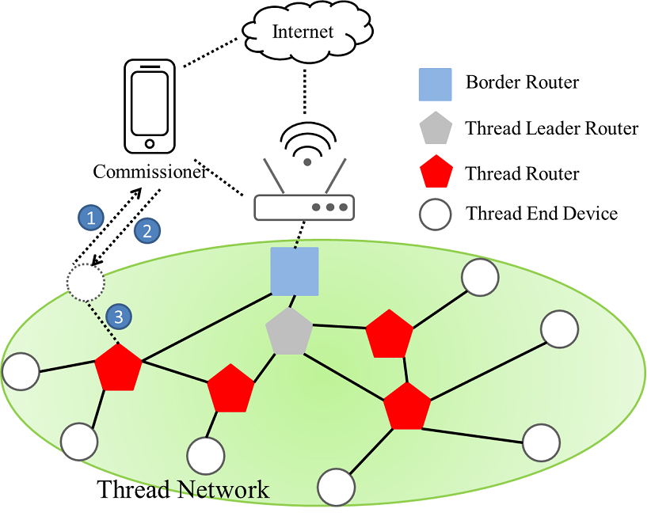
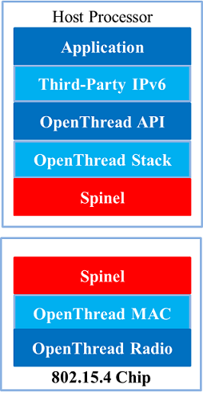

.. _thread_overview:

===============
Thread Overview
===============

Thread is a 2.4GHz (IEEE 802.15.4) and IPv6-based wireless mesh network protocol, commonly called a Wireless Personal Area Network (WPAN).
Thread is specifically built for low-power, low-latency Internet of Things (IoT) devices. 
It solves the complexities of the IoT, addressing challenges such as interoperability, range, security, energy, and reliability. 

The section provides an overview of the network topology, openthread and Radio Co-Processor (RCP) mode of the Thread protocol.
 
Network Topology
================ 

Thread network topology is designed to be robust, self-healing, and scalable, providing secure and reliable communication for devices in a mesh network. Below, you'll find an overview of the key components of a Thread network topology.

Device Types
------------
OpenThread differentiates between various device types based on the roles they can assume within the Thread network.

1. **Full Thread Device (FTD)**

   A FTD can function as both a router and an end device within the Thread network. Its radio remains continuously active.

2. **Minimal Thread Device (MTD)**

   A MTD is always an end device and relies on its parent to forward all messages.

   There are two important subtypes of MTDs:

   - **Minimal End Device (MED)**
   
     This type keeps its radio on at all times, allowing it to receive messages from its parent without any delay. MEDs are suitable for devices that need to be more responsive and can afford the higher power consumption due to having a constant power source or a rechargeable battery.

   - **Sleepy End Device (SED)**
   
     This type conserves power by keeping its radio off most of the time and only waking up periodically to communicate with its parent. SEDs are ideal for battery-operated devices that do not need to constantly send or receive data.

Key Components
--------------

1. **Leader Router**

   The leader is the device responsible for managing the network. It assigns router IDs and handles network configuration changes. The leader is elected dynamically, and if the current leader fails, another router takes over, ensuring the continuity of network operation.

2. **Router**

   Routers are devices that route packets within the Thread network. They help extend the range of the network and enhance reliability. Routers can communicate directly with other routers and the leader.   

   Routers can also become the leader if the current leader goes down.

3. **REED (Router-Eligible End Device)**

   These are end devices that have the potential to become routers if the network requires it. They perform routing functions only when promoted to routers by the leader, thereby maintaining an efficient use of resources.

4. **End Device**

   End devices, also known as sleepy end devices (SEDs), mainly communicate with a single parent router or REED. They do not forward packets for other devices. SEDs are energy-efficient, as they spend most of their time in a low-power state.

5. **FED (Full End Device)**

   Full end devices are similar to end devices but stay awake to receive packets more frequently. They do not route packets but communicate with their parent router.

6. **SED (Sleepy End Device)**

   These devices periodically wake up to exchange data with their parent router and spend most of the time in a low-power sleep mode, making them ideal for battery-powered applications.

7. **Commissioner**

   The commissioner role is responsible for authenticating and commissioning new devices to the network. It handles the secure joining process, ensuring only authorized devices can join the network. The Commissioner can either be integrated within the Thread network (Native) or operate from outside the Thread network (External).

8. **Border Router**

   A border router connects the Thread network to other networks like Wi-Fi, Ethernet, or the Internet. It provides external connectivity and routes data between the Thread network and external networks.

External Thread Commissioning
-----------------------------

In external Thread commissioning, the process utilizes a Commissioner device that is connected to a different network, such as Wi-Fi or Ethernet, rather than the Thread network. This external Commissioner, such as a mobile phone, facilitates the addition of new devices to the Thread network by using the Thread Border Router as an intermediary.

Here is the process for performing external commissioning using a mobile phone:

1. Use the mobile app to scan the BLE broadcast emitted by the Thread end device and establish a BLE connection.

2. The mobile app connects via BLE to sync the OTBR network credentials to the Thread end device.

3. The Thread end device uses the credentials to join the Thread network.

Example Network Topology
------------------------

The following image shows an example of Thread Network Topology and also demonstrates the process of external commissioning using a mobile phone.

	Thread Network Topology Example
	
	

Openthread
==========

OpenThread is an open-source implementation of Thread networking protocol. 
It was developed by Google and freely available to developers in order to accelerate 
the development of products for the connected home and commercial buildings.

GitHub
------

OpenThread is released under the BSD 3-Clause license and is available on GitHub:
https://github.com/openthread/openthread

Setup and Use OpenThread CLI for Device Emulation
-------------------------------------------------

This example application exposes OpenThread configuration and management APIs via a
simple command-line interface. The steps below take you through the minimal steps
required to ping one emulated Thread device from another emulated Thread device.

Steps to Ping One Emulated Thread Device from Another
^^^^^^^^^^^^^^^^^^^^^^^^^^^^^^^^^^^^^^^^^^^^^^^^^^^^^
.. highlight:: rst

1. Set Up the Environment.
   
   - Install the necessary dependencies and tools for compiling OpenThread (e.g., GNU Autotools, GCC, and CMake).
   
   - Clone the OpenThread repository.
   
   ::

     $ git clone https://github.com/openthread/openthread.git
     $ cd openthread

2. Build OpenThread.
   
   - Configure and build the OpenThread CLI application.

   ::

     $ ./script/bootstrap
     $ ./script/cmake-build simulation

3. Run the Thread Simulator.
   
   - Open separate terminal windows for each emulated device.
      
   - Start the OpenThread simulation with different node ID for each device.

   ::
	 
     $ ./build/simulation/examples/apps/cli/ot-cli-ftd 1
     
     This starts the full Thread device (FTD) CLI with node ID 1.

4. Configure and Form a Thread Network.

   - Configure the first device as a leader.

   ::
	 
     > dataset init new
     Done
     > dataset
     Active Timestamp: 1
     Channel: 24
     Channel Mask: 0x07fff800
     Ext PAN ID: b7d261da17292918
     Mesh Local Prefix: fd74:3bcf:ba49:f9ba::/64
     Network Key: a0d75caa58cf2fb0b91d5da586adda3a
     Network Name: OpenThread-2373
     PAN ID: 0x2373
     PSKc: 483459904e7b84b098c6b2626ec3cf2c
     Security Policy: 672 onrc 0
     Done
     > dataset commit active
     Done
     > ifconfig up
     Done
     > thread start
     Done
     (wait for a moment)
     > state
     Leader
     Done

     The device state should eventually display `leader`.

   - Configure the second device and have it join the network.

   ::

     $ ./build/simulation/examples/apps/cli/ot-cli-ftd 2
     > dataset networkkey a0d75caa58cf2fb0b91d5da586adda3a
     Done
     > dataset panid 0x2373
     Done
     > dataset commit active
     Done
     > ifconfig up
     Done
     > thread start
     Done
     (wait for a moment)
     > state
     Router # or Child
     Done

     The device state should eventually display `router` or `child`.

5. Get the IPv6 Addresses.

   - On the leader device, get the list of IPv6 addresses.

   ::
	 
     > ipaddr
     
     Identify a suitable IPv6 address (e.g., a `fd00::` address).

   - Do the same on the second device to confirm it has joined the network.

6. Ping Between Devices.

   - From one device, ping the other using its IPv6 address.

   ::
	 
     > ping <IPv6-address-of-other-device>
	 

.. highlight:: none
	 
	 
	 

OpenThread RCP Mode
===================

In Co-Processor design, the application runs on host processor and the other controller 
processor provides the Thread radio. These two processors communicate through a serial 
connection with standard protocol (Spinel). In an RCP (Radio Co-Processor) design, the core of OpenThread runs 
on the host processor and the controller processor only implements a minimal MAC layer 
with the Thread radio. The communication between the RCP and the host processor is managed 
by OpenThread Daemon through a serial interface over the Spinel protocol. The advantage of
RCP design is that OpenThread can use the resources on the more powerful host processor. 
To ensure the reliability of Thread network, the host processor typically does not sleep. 
This design is useful for devices that are less sensitive to power constraints.

	 
	RCP Mode

Key Components
--------------
.. highlight:: rst

1. **Host Processor**
   
   - Runs the upper layers of the OpenThread stack, including Thread networking, mesh routing, and application logic.
   - Typically runs a POSIX-compatible operating system, such as Linux.

2. **Radio Co-Processor (RCP)**
   
   - Handles the lower layers of the OpenThread stack, specifically the 802.15.4 PHY and MAC layers.
   - Executes time-critical radio operations.
   - Communicates with the host processor via a serial interface (e.g., UART, SPI).

Setting Up RCP Mode with OpenThread
-----------------------------------

This example application exposes OpenThread configuration and management APIs via a
simple command-line interface. The steps below take you through the minimal steps
required to ping one Thread device from another Thread device over RCP.

Steps to Ping One Thread Device from Another over RCP
^^^^^^^^^^^^^^^^^^^^^^^^^^^^^^^^^^^^^^^^^^^^^^^^^^^^^

1. Build OpenThread Daemon.

   - Configure and build the OpenThread Daemon.

   ::

     $ cd openthread
     $ ./script/bootstrap
     $ ./script/cmake-build posix -DOT_DAEMON=ON

2. Connect the Host and the RCP dongle.
   
   - The host and RCP communicate over USB or UART.

   - The RCP dongle should be recognized as /dev/ttyACMx or /dev/ttyUSBx. (e.g., /dev/ttyACM0)

   - Ensure the serial connection settings (baud rate) are correctly configured on both sides. (Typically, RCP dongle baud rate setting is 2000000.)

3. Run the Thread RCP mode.

   - Start ot-daemon to initiate the RCP device.

   ::

     $ ./build/posix/src/posix/ot-daemon -v 'spinel+hdlc+uart:///dev/ttyACM0?uart-baudrate=2000000'

   - Open another terminal window and run ot-ctl command.

   ::

     $ ./build/posix/src/posix/ot-ctl
   
     This starts the command-line interface (CLI) to configure the Thread device.

4. Configure and Form a Thread Network.

   - Configure the first device as a leader.

   ::
   
     > dataset init new
     Done
     > dataset
     Active Timestamp: 1
     Channel: 24
     Channel Mask: 0x07fff800
     Ext PAN ID: b7d261da17292918
     Mesh Local Prefix: fd74:3bcf:ba49:f9ba::/64
     Network Key: a0d75caa58cf2fb0b91d5da586adda3a
     Network Name: OpenThread-2373
     PAN ID: 0x2373
     PSKc: 483459904e7b84b098c6b2626ec3cf2c
     Security Policy: 672 onrc 0
     Done
     > dataset commit active
     Done
     > ifconfig up
     Done
     > thread start
     Done
     (wait for a moment)
     > state
     Leader
     Done

     The device state should eventually display `leader`.

   - Get another Host and RCP dongle.

   - Configure the second device and have it join the network.

   ::

     $ ./build/posix/src/posix/ot-daemon -v 'spinel+hdlc+uart:///dev/ttyACM0?uart-baudrate=2000000'
     $ ./build/posix/src/posix/ot-ctl
     > dataset networkkey a0d75caa58cf2fb0b91d5da586adda3a
     Done
     > dataset panid 0x2373
     Done
     > dataset commit active
     Done
     > ifconfig up
     Done
     > thread start
     Done
     (wait for a moment)
     > state
     Router # or Child
     Done

     The device state should eventually display `router` or `child`.

5. Get the IPv6 Addresses.

   - On the leader device, get the list of IPv6 addresses.

   ::
   
     > ipaddr
     
     Identify a suitable IPv6 address (e.g., a `fd00::` address).

   - Do the same on the second device to confirm it has joined the network.

6. Ping Between Devices.

   - From one device, ping the other using its IPv6 address.

   ::
   
     > ping <IPv6-address-of-other-device>

.. highlight:: none
